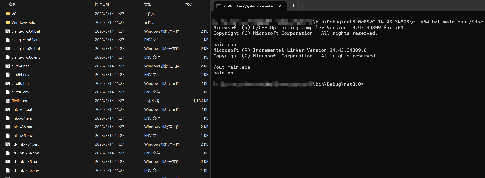

# MinimalMSVC

## Description

MinimalMSVC can copy the VC SDK and Windows SDK from the current host and create minimal invocation scripts. It supports x86/x64 architectures and includes tools such as cl/clang-cl/link/lld-link. The compressed 7z format requires only 140MB of transfer size at minimum.

## Usage

1. Install Visual Studio 2019/2022
1. Run `build.bat`, which will create the `MinimalMSVC.exe` program in the `bin` folder
1. Run `MinimalMSVC.exe`, which will generate an `MSVC-xxx` folder (e.g., `MSVC-14.43.34808`) in the current directory
